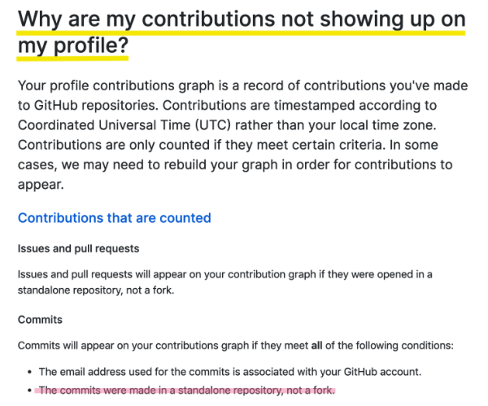

  

## 멘붕이 왔다 🤯
---------------------------

어제와 그제 [Beautiful Jekyll](https://github.com/daattali/beautiful-jekyll) 를 fork 해서 블로그를 만들고, 첫 포스팅을 마친 후 신나게 push했다.
그리고 뿌듯한 마음으로 오늘도 잔디가 예쁘게 깔려있겠지? 하고 봤는데
  

        

………..??????

        

 

이럴 수는 없아ㅓㄹ.머이ㅓㅡㄴ치ㅏㅓㅡㅌ.

  

## 이유는 그렇다.
---------------------------

<a herf="https://help.github.com/en/articles/why-are-my-contributions-not-showing-up-on-my-profile">
 https://help.github.com/en/articles/why-are-my-contributions-not-showing-up-on-my-profile</a>
 
내 잔디가 깔릴려면 위의 요건이 충족되어야 한다.
<pre>
1. GitHub 계정과 commit 이메일 계정이 동일하거나 
2. commit이 Fork한 repository가 아닌 나만의 repository에서 이루어져야 한다</pre>

1번과 같은 경우는 config의 설정이 잘못된 경우이지만, (아래 참고)

2번의 경우인 나는 fork만 해왔기 때문에 그동안 내 repository가 아닌 fork해온 repository에 commit 해온 것이다(…..)

>   [Github에 잔디가 안심어질 때! :: 천천히, 빠르게. 개발자의 Repository](https://devkyu.tistory.com/872)

  

## 그럼 어떡해?
---------------------------

기존에 fork해온 repository를 날리고,

다시 repository를 생성한다.

fork로 가져왔었던 clone한 프로젝트를 새롭게 commit & push

 

>  *이렇게 해도 내 잔디는 돌아오지 않는다….히스토리가 날아갔기 때문에….*

 

어제 오늘 구글에 검색해봐도 config에 대한 내용만 나와서 해맸던 나와 같은 사람들이 있을까봐 포스팅한다.

GitHub의 기능을 제대로 알고 쓰자….😭
