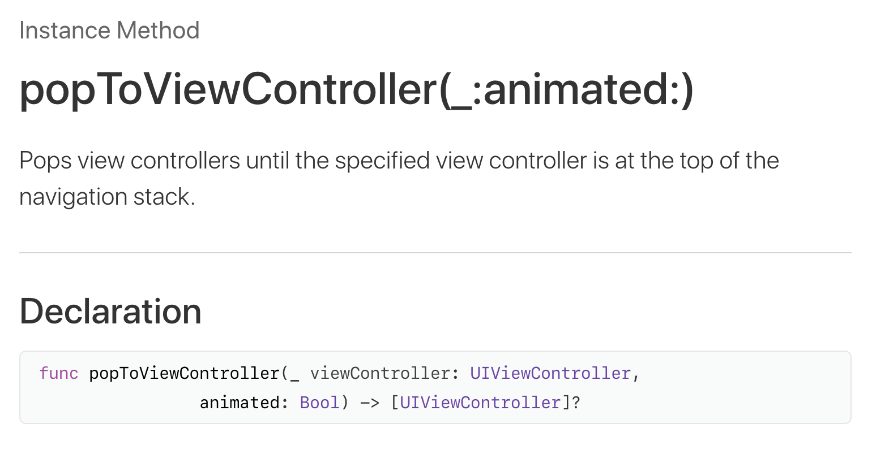

<br>

## Pop ViewController
----------------
<br>
UINavigationViewController를 이용하여

ViewController (이하 VC) 를 이동할때

> ​	A  &nbsp; &nbsp;➤ &nbsp; &nbsp; B&nbsp;   &nbsp;➤ &nbsp;  &nbsp;C  &nbsp;  &nbsp;➤ &nbsp; &nbsp; D

이런 상황에서 


<br>

> ​	A &nbsp;&nbsp;➤ &nbsp;&nbsp;  B   

이렇게 B view로 돌아가고, B 앞에 있던 view들을 stack에서 지우고 싶을 때가 있다.

위처럼 중간에서 이미 지나왔었던 view로 이동하려면 어떻게 해야할까?

<br><br>

## How To?
----------------

<center><br><a href="https://developer.apple.com/documentation/uikit/uinavigationcontroller/1621871-poptoviewcontroller">https://developer.apple.com/documentation/uikit/uinavigationcontroller/1621871-poptoviewcontroller</a></center>
<br>

아하! 저렇게 원하는 VC를 지정해서가면 되는구나!ㅎㅎ

하고 pushVC할 때처럼 하면 되겠지 하고 작성하면 아래와 같은 런타임 에러를 만날 수 있다 (🤬)

<br>

<pre>**2019-07-27 18:28:49.653221+0900 Ceramics[1868:71486] \**\* Assertion failure in -[UINavigationController popToViewController:transition:], <br>/BuildRoot/Library/Caches/com.apple.xbs/Sources/UIKitCore_Sim/UIKit-3698.103.12/UINavigationController.m:8176**
<br>2019-07-27 18:28:49.670062+0900 Ceramics[1868:71486] *** Terminating app due to uncaught<br> exception 'NSInternalInconsistencyException', reason: 'Tried to pop to a view controller that doesn't exist.'
</pre>

<br>

존재하지 않는 뷰로 pop을 시도해서라고 뜬다

이유는 stack에 존재하는게 아닌 새로 생성된 VC로 이동하려고 했기 때문이다.

기존에 있던 VC가 아닌 없던 새로운 VC를 불러오라고 하는구나 하고 생각하는 것이다.

<br><br>

## 그럼 어떡하라고? 👿
----------------
간단하다!

ViewController stack에 있는지 확인하고 있다면 해당 VC를 파라미터에 넣어주면 된다.

```swift
let controllers = self.navigationController?.viewControllers 
for vc in controllers! {
    if vc is MyViewController {
                _ = self.navigationController?.popToViewController(vc as! MyViewController, animated: true)
    }
}
```

<br>

위처럼 작성하면 현재 위치에서 MyViewController가 있는 곳으로 이동하고 그 사이의 VC는 stack에서 사라지게 된다.

<br>