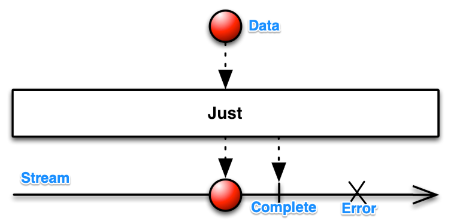

 
 

### RxSwift란?
Observable streams를 위한 비동기성 프로그래밍을 위한 API이다.
비동기성 프로그래밍은 동시에 수행하는 작업이 동기화 되지 않고 개별적으로 수행되는 것을 의미한다.
즉, 다른 작업이 끝나기를 기다리지 않고(동기화하지 않고) 수행하는 것이다.

 

### Marbles Diagram
Observable Stream을 표현하는 Diagram

 
 

### Operator
>  곰튀김님이 짚어주신 것만 정리함 
>  [참고] http://reactivex.io/documentation/ko/operators.html

 
* Disposable : Observable 동작을 취소한다.
* DisposeBag : Disposable을 담는 가방, 여러개를 한번에 취소할 때 유용함

생성
- Create
- Just : update가 될 때 인자값으로 넣어준 값을 그대로 내려보내줌
  * 내려준 객체 그대로, string, array, …… 다
* From : array일 경우 값 하나씩 떼어서 보내준다.

변환, 필터링
* Map : 데이터를 원하는 것으로 가공, 위에서 넘겨주는 데이터를 가공해서 아래로 넘겨줌
* Filter : 데이터를 필터링, 위에서 넘겨주는 데이터를 필터링해서 특정 데이터만 아래로 넘겨줌

* Concat : 2개의 Observable stream 을 합쳐준다. 1번째 데이터를 전달하고 나면, 2번째 stream의 데이터를 전달
* CombineLatest : Observable을 결합시켜 새로 생성, 마지막으로 배출 항목을 결합시켜 배출한다.

* Subscribe : Observable stream의 해당 데이터를 가지고 실행 할 행동, return Disposable
    * subscribe(on: (Event<String>) -> Void) : next(데이터 전달), error(에러), completed(stream 완료)의 유형이 있음
    * subscribe(onNext: ((Any) -> Void)?, onError:  ((Error) -> Void)?, onCompleted: (( ) -> Void)?, onDisposed: (( ) -> Void)?) : onNext, onError, onCompleted, onDisposed(Observer 해체 시 완료) 중 필요한 것만 처리 가능

 
 

### Scheduler
stream이 동작하는 스레드를 변경해준다.
 

* observeOn(scheduler) : 인자값의 스레드 스케쥴러에서 아래의 stream 들을 동작하게 한다. (stream이 비동기화 되도록 해줌)
* subscribeOn(scheduler) : subscribe된 순간 부터 인자값 스레드 스케쥴러에 stream을 동작 (아무 곳에나 입력해도 상관 x)

- SideEffect
: 외부에 영향을 주는 부분. (Subscribe(), do() 에서 SideEffect를 허용한다.)

++ RxCocoa : RxSwift를 사용할때 유용한 UI extension

 
 

### Subject
subject를 subscribe를 한 곳에 생성되는 데이터를 전달해준다. 
 

* AsyncSubject
: subject stream이 종료되는 시점에 가장 마지막 데이터를 전달
* BehaviorSubject
: 데이터가 생성되는 시점과 subscribe 하는 시점에 가장 최근 데이터를 전달. default값이 있음
* PublishSubject 
: 데이터가 생성되는 시점에만 데이터 전달. default값 없음
* ReplaySubject
:  데이터가 생성되는 시점과 subscribe 하는 시점에 이전의 생성되었던 데이터 모두 전달(없으면 x). default값 없음

 
 

출처 및 참조

- <a href="https://www.youtube.com/watch?v=w5Qmie-GbiA/">[곰튀김님 : RxSwift 4시간에 끝내기 (종합편)] </a>

 
