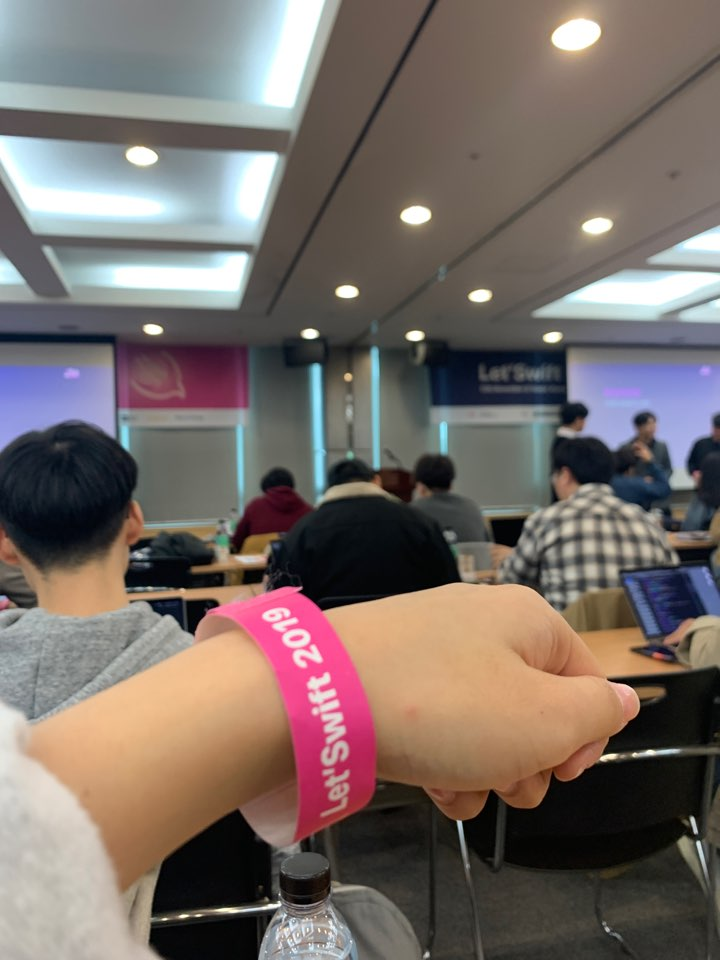
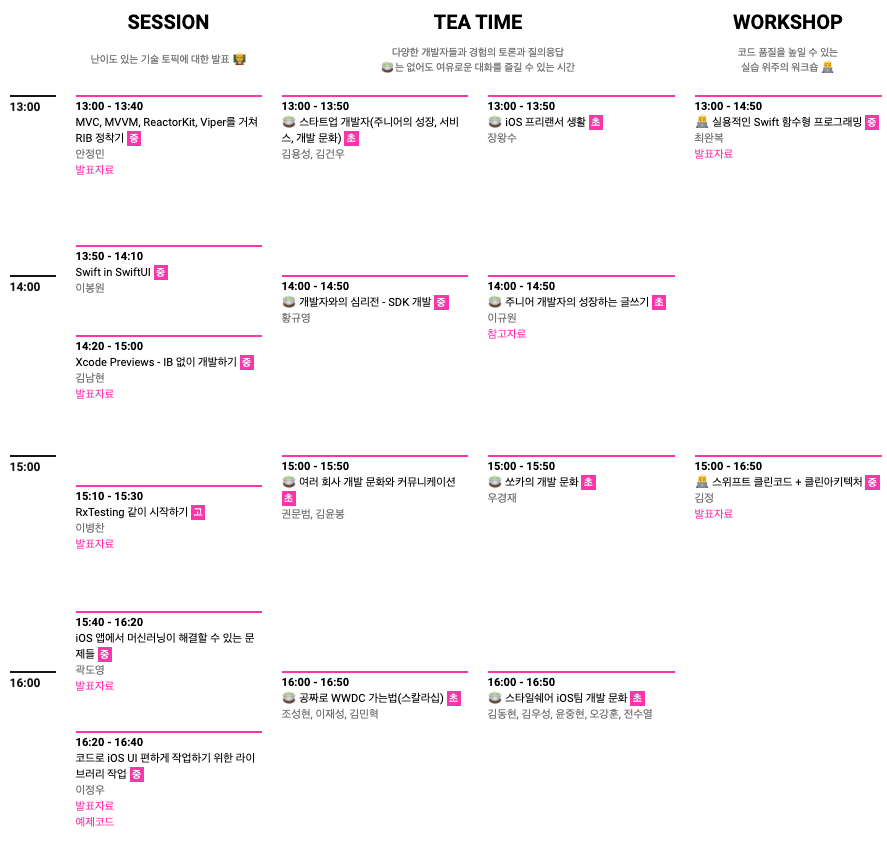
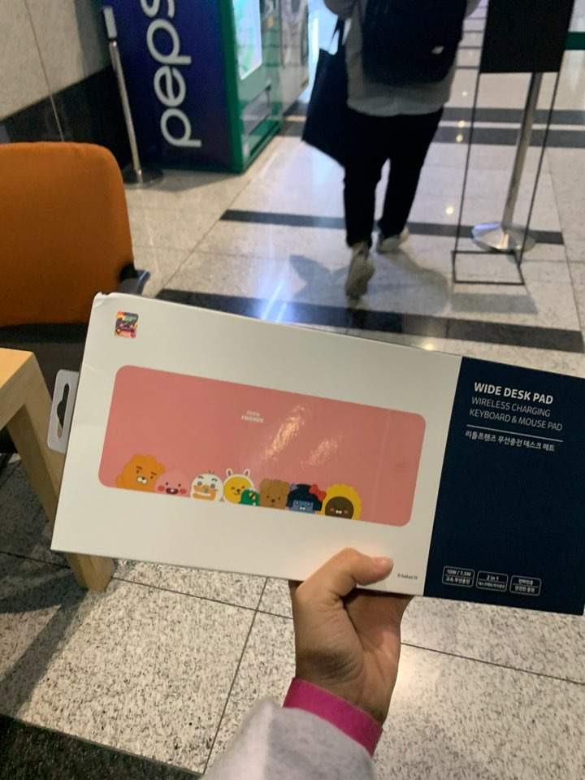

2019년 11월 14일 엊그제, 드디어 Swift 컨퍼런스 Let's Swift 를 다녀왔다.

iOS를 시작한 이후로 처음으로 참여한 Swift 행사이자 iOS 행사였기에 많은 기대가 컸던 만큼 치열한 티켓팅을 거쳐 갈 수 있었다. 거의 아이돌 행사 급으로 티켓팅을 한거 같다... iOS 개발자들 열정man...

티켓팅이 치열한 만큼 구성도 다양하고 알찼다. 몸이 한개라 한 번에 한 개씩만 들을 수 있다는게 아쉬울 정도 였다.

행사는 am 9:30 ~ pm 5:00 까지 진행 되었다.

오전에는 공통적으로 세션을 듣고, 오후에는 세션, 티타임 1/2, 워크숍 4개 중 시간대별로 자신이 듣고 싶은 참여하고 싶은 세션에 선착순으로 가서 듣는 형식이었다.

세션은 주로 기술적인 발표를 듣는 것이었고, 티타임은 다양한 주제로 개발자 분들의 이야기와 Q&A를 진행했다. 그리고 워크숍은 코드스쿼드의 강연자 분들이 수업을 해주시고, 직접 실습까지 해보는 실습 세션이었다.

 

나는 세션 2개 + 워크숍 1개를 들었다.

- MVC, MVVM, Reactor Kit, VIPER를 거쳐 RIBs 정착기 (민소네님)
- Swift in SwiftUI (이봉원님)
- 스위프트 클린코드 + 클린아키텍쳐 (김정님)

+중간에 화장실 가면서 전수열님 실물 보고오기

 

먼저 RIBs에 대해 들었던 첫번째 세션에서는 RIBs의 간략한 설명과 RIBs를 사용하는 이유에 대해서 말씀해주셨다.

기존의 아키텍쳐들이 뷰에 종속되어있는 것과 일정한 표준이 없다는 말에 격한 공감이 갔다. 최근에 아키텍쳐를 공부하면서 예제들을 보는데 개발자마다, 프로젝트 형태마다 달라서 감을 익히는게 굉장히 어려웠고, 지금도 어렵다...🤯 

RIBs는 이런 단점을 보완해 Viewless이고, 템플릿화 된 코드와 테스트 작성을 할 수 있다고 하셨다. 아무튼 공부할게 또 늘었다^^^^^

 

그 다음 들었던 SwiftUI에 대한 세션에서는 SwiftUI의 소개, 구성, 간단한 사용방법들을 설명해 주셨다. 아직 문서와 예제가 많이 없어서 삽질을 많이 해야했던 나에게 이론적인 내용을 한번에 정리를 할 수 있는 시간이 되었다. 

 

마지막 워크숍으로 참여했던 스위프트 클린코드 + 클린 아키텍쳐 에서는 클린한 코드와 클린한 아키텍쳐를 작성하는 방법에 대해 강연해주셨다.

코드 리펙터링을 해보고 김정님께서 직접 코드리뷰를 해주시는 실습을 했다!! 정말 좋은 경험이었다. 클린한 코드, 아키텍쳐, 오브젝트를 만드는 법과 객체지향에 기본을 정리할 수 있는 시간이었다. 

또 그런 기본을 잘 할 수 있는 책을 추천해 주셨다. 정말 좋은 책 같아서 시켜버렸다..... 이제 슬슬 iPad를 살때가 온거 같다... 개발 서적은 너무 무거워서 들고 다니면서 보기가 너무 힘들다. 핑계가 아니ㅏㄴ아아ㅏ

 

이번 Let's Swift 행사 iOS 개발자 분들을 만나 자극도 받고 지식도 얻는 좋은 자리였다. 앞으로는 이런자리가 다른 웹이나 안드 행사처럼 자주 했으면 좋겠다 ㅠㅠㅠ 

별점 : ⭐️⭐️⭐️⭐️⭐️ + ⭐️ (내가 참여한 Swift 첫 행사라 +1)

 

그럼 다음에는 이번주 토요일 렛어스고 행사 후기를 써보겠다 😎

 

아 그리고 가서 무선 충전기 장패드 경품도 탔다! 잘 쓰고 있습니다 감사합니당~

